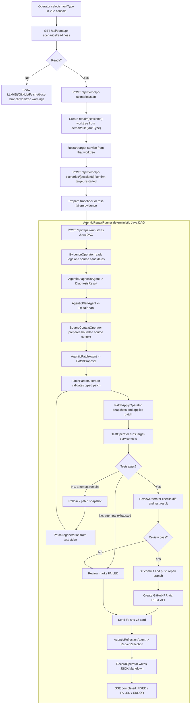

# Agent AI Ops

[中文说明](README.zh-CN.md)

Agent AI Ops is a Java demo for an Agent-based service auto-repair loop:

```text
service failure -> read traceback -> diagnose root cause -> patch code -> run tests
-> create GitHub PR -> notify reviewers in Feishu -> record and reflect
```

## Git Description

`main` is the upload-safe repaired baseline. Demo faults are not injected into `main`; real PR demos use committed single-fault base branches:

```text
main                                  repaired baseline
demo/fault/{faultType}                main plus one intentional fault
repair/{sessionId}                    Agent-generated repair branch in an isolated worktree
repair-records/{sessionId}.json|md    repair record artifacts
```

The PR-safe scenario API derives `demo/fault/{faultType}` from the selected fault and creates `repair/{sessionId}` under `REPAIR_WORKTREE_ROOT/{sessionId}`. The main checkout stays on `main` while the repair workflow reads, patches, tests, commits, and pushes from the isolated worktree.

Commit scope is intentionally narrow:

- repair tools can write only `target-service/src/main` and `target-service/src/test`;
- Git commit stages only those two directories;
- runtime files such as `target-service/files/welcome.txt`, logs, and repair records are not part of repair PRs;
- secrets and local config stay in ignored files such as `application-local.yml`.

## Change Description

**Title: Expand PR-safe Repair Demo and Workflow Guardrails**

本次变更围绕复赛演示闭环做了集中增强：在保持 `main` 为正常修复态的前提下，补齐并验证了 `precision-loss`、`race-condition`、`path-traversal` 等更贴近真实业务的故障场景，使 PR-safe 演示可以按 `faultType` 自动选择 `demo/fault/{faultType}` 单故障 base 分支，并在独立 worktree 中完成修复、测试、提交和 PR。

Agent 修复链路也做了工程化加固：Patch Agent 继续输出强类型补丁 proposal，DAG 负责路径校验、oldText 精确匹配、原子应用、回归测试和 Review Gate；当测试失败时，Reflexion 会先回滚再基于失败输出重写补丁。补丁阶段的读代码和搜索事件被归类到 `patching`，避免前端时间线误回到计划阶段。

Git 与交付边界进一步收紧：提交修复分支时只 stage `target-service/src/main` 和 `target-service/src/test`，避免测试运行时文件、日志或本地记录进入 PR。修复记录继续保留 diff、测试、PR、飞书、耗时、token 和反思信息，便于复赛视频展示完整闭环。

## Modules

```text
agent-platform/   Spring Boot Agent backend, port 9901
target-service/   Spring Boot service under repair, port 9910
frontend/         Vue 3 + Vite + TypeScript demo console
repair-records/   generated repair records, gitignored
```

## Full Flow



## Detailed Method

1. Readiness: the frontend calls `GET /api/demo/pr-scenarios/readiness?faultType=...` to check LLM, Git, GitHub, Feishu, base branch, and worktree settings without exposing secrets.
2. Worktree setup: `POST /api/demo/pr-scenarios/start` derives `demo/fault/{faultType}` and creates `repair/{sessionId}` in `REPAIR_WORKTREE_ROOT`.
3. Failure evidence: target-service is restarted from the worktree. Runtime faults produce traceback files; test-only faults run one target-service test pass and write the failure output as the newest evidence log.
4. Diagnosis and plan: LangChain4j sub-agents return typed `DiagnosisResult` and `RepairPlan` objects. Java validators retry once on invalid structured output.
5. Patch: the Patch Agent receives the plan, bounded source context, and ranked few-shot examples from previous successful repair records. The model outputs a typed `PatchProposal`; only `PatchTools + ToolPolicy` may write files.
6. Reflexion: if tests fail, the system rolls back the snapshot and asks the patch-regeneration agent to rewrite the patch using the failing stdout/stderr. Attempts are bounded by `REPAIR_MAX_PATCH_ATTEMPTS`.
7. Review: the reviewer blocks unsafe diffs, empty diffs, failed tests, and paths outside `target-service/src/main` or `target-service/src/test`.
8. PR and notification: after review passes, Git commits and pushes `repair/{sessionId}`, GitHub REST creates the PR, and Feishu sends a v2 card with outcome, root cause, review result, PR URL, timing, and token usage.
9. Reflection and records: the reflection agent summarizes lessons learned; records are written under `repair-records/` and exposed through the repair record APIs.

## Supported Faults

```text
quantity-division-by-zero -> demo/fault/quantity-division-by-zero
wrong-quote-route         -> demo/fault/wrong-quote-route
wrong-error-status        -> demo/fault/wrong-error-status
precision-loss            -> demo/fault/precision-loss
race-condition            -> demo/fault/race-condition
path-traversal            -> demo/fault/path-traversal
```

Each `demo/fault/...` branch should contain exactly one intentional fault. Mixing faults causes unrelated tests to block the repair PR.

## Run

Start from the repo root:

```powershell
cd D:\java_web_project\agent-aiOps
```

Start target-service:

```powershell
mvn -pl target-service spring-boot:run
```

Start agent-platform:

```powershell
mvn -pl agent-platform spring-boot:run
```

Build and serve the frontend through agent-platform:

```powershell
npm --prefix frontend install
npm --prefix frontend run build
mvn -pl agent-platform spring-boot:run
```

Open:

```text
http://localhost:9901/
```

Frontend dev server:

```powershell
npm --prefix frontend run dev
```

## PR-Safe Demo

Required environment for a real PR run:

```powershell
$env:REPAIR_LLM_ENABLED="true"
$env:REPAIR_GIT_ENABLED="true"
$env:REPAIR_GITHUB_ENABLED="true"
$env:REPAIR_GITHUB_CLIENT="rest"
$env:GITHUB_TOKEN="your GitHub token"
$env:FEISHU_ENABLED="true"
$env:FEISHU_WEBHOOK_URL="your Feishu webhook"
$env:FEISHU_SIGNING_SECRET="optional signing secret"
$env:REPAIR_WORKTREE_ROOT="../agent-aiOps-worktrees"
```

Start a PR-safe scenario:

```powershell
$body = @{ sessionId = "pr-precision-001"; faultType = "precision-loss" } | ConvertTo-Json
$scenario = Invoke-RestMethod -Method Post `
  -Uri "http://localhost:9901/api/demo/pr-scenarios/start" `
  -ContentType "application/json" `
  -Body $body
```

Restart target-service from the worktree, then confirm:

```powershell
Invoke-RestMethod -Method Post `
  -Uri "http://localhost:9901/api/demo/pr-scenarios/pr-precision-001/restart-target-service"

Invoke-RestMethod -Method Post `
  -Uri "http://localhost:9901/api/demo/pr-scenarios/pr-precision-001/confirm-target-restarted"
```

Watch SSE:

```powershell
curl.exe -N "http://localhost:9901/api/repair/stream/pr-precision-001"
```

Manual restart fallback:

```powershell
Push-Location $scenario.worktreePath
mvn -pl target-service spring-boot:run
```

## Local Fault Injection

Source-injection APIs dirty the current checkout and are meant for local debugging, not real PR demos:

```powershell
Invoke-RestMethod -Uri "http://localhost:9901/api/demo/faults"
Invoke-RestMethod -Method Post -Uri "http://localhost:9901/api/demo/faults/quantity-division-by-zero/inject"
Invoke-RestMethod -Method Post -Uri "http://localhost:9901/api/demo/faults/reset"
```

Restart `target-service` after injection or reset.

## API Surface

```text
POST /api/repair/run
GET  /api/repair/stream/{sessionId}
GET  /api/repair/records
GET  /api/repair/records/{sessionId}

GET  /api/demo/faults
POST /api/demo/faults/{faultType}/inject
POST /api/demo/faults/reset

POST /api/demo/scenarios/start
GET  /api/demo/scenarios/{sessionId}
POST /api/demo/scenarios/{sessionId}/confirm-target-restarted

GET  /api/demo/pr-scenarios/readiness?faultType=...
POST /api/demo/pr-scenarios/start
GET  /api/demo/pr-scenarios/{sessionId}
POST /api/demo/pr-scenarios/{sessionId}/restart-target-service
POST /api/demo/pr-scenarios/{sessionId}/confirm-target-restarted
```

## Environment

```text
REPAIR_WORKSPACE_ROOT=${user.dir}
REPAIR_TARGET_ROOT=target-service
REPAIR_TARGET_LOG=target-service/logs
REPAIR_TEST_COMMAND=mvn -pl target-service test
TARGET_SERVICE_BASE_URL=http://localhost:9910

REPAIR_LLM_ENABLED=false
REPAIR_LLM_PROVIDER=openai
REPAIR_LLM_TEMPERATURE=0.1
REPAIR_LLM_MAX_TOKENS=4096
REPAIR_LLM_TIMEOUT_SECONDS=180
REPAIR_LLM_MAX_RETRIES=1
REPAIR_LLM_REFLECTION_MODEL=
OPENAI_API_KEY=
OPENAI_BASE_URL=https://api.openai.com/v1
DASHSCOPE_API_KEY=
DASHSCOPE_BASE_URL=

REPAIR_MAX_ATTEMPTS=3
REPAIR_MAX_PATCH_ATTEMPTS=2
REPAIR_PROCESS_TIMEOUT_SECONDS=120
REPAIR_AGENTIC_FILE_READ_CACHE_ENABLED=true

REPAIR_GIT_ENABLED=false
REPAIR_GIT_REMOTE=origin
REPAIR_BASE_BRANCH=demo/fault/quantity-division-by-zero
REPAIR_WORKTREE_ROOT=../agent-aiOps-worktrees

REPAIR_GITHUB_ENABLED=false
REPAIR_GITHUB_CLIENT=rest
GITHUB_TOKEN=
REPAIR_GITHUB_OWNER=
REPAIR_GITHUB_REPO=
REPAIR_GITHUB_API_BASE_URL=https://api.github.com

FEISHU_ENABLED=false
FEISHU_WEBHOOK_URL=
FEISHU_SIGNING_SECRET=

REPAIR_MONITOR_ENABLED=false
REPAIR_MONITOR_POLL_INTERVAL_SECONDS=30
```

Put local secrets and model choices in:

```text
agent-platform/src/main/resources/application-local.yml
```

## Verification

```powershell
mvn -pl agent-platform test
mvn -pl target-service test
npm --prefix frontend run build
```

`target-service` on `main` should be in the repaired state. Use demo fault APIs or committed `demo/fault/...` branches to replay failures.

## Records

Repair runs write:

```text
repair-records/{sessionId}.json
repair-records/{sessionId}.md
```

Records include evidence, diagnosis, plan, patch proposal, diff, tests, review, PR, notification, timing, model usage, and reflection.

## Safety

- AI sub-agents are read-only.
- File writes go only through `PatchTools + ToolPolicy`.
- Patch `oldText` must match exactly and uniquely before files are written.
- Allowed write paths are `target-service/src/main` and `target-service/src/test`.
- Git commits stage only source and test roots.
- LLM, GitHub, Feishu, and monitor integrations are disabled by default.
