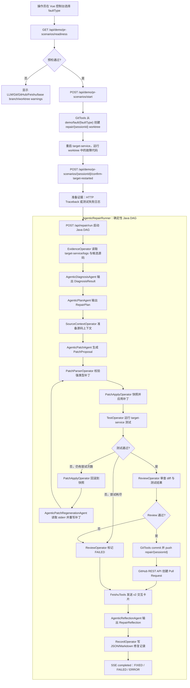

# Agent AI Ops

基于 Agent 的服务自动化修复系统。项目用于演示一条完整闭环：

```text
服务报错 -> Agent 读取 Traceback -> 分析根因 -> 自动修改代码 -> 运行测试
-> 创建 GitHub PR -> 飞书通知开发者 Review -> 生成修复记录和反思沉淀
```

当前实现是一个 Java 多模块演示系统：`agent-platform` 负责修复编排，`target-service` 是被修复服务，`frontend` 是评委演示控制台。

## Git 描述

当前 `main` 分支是上传安全的正常修复态，不直接携带演示故障。真实 PR 演示通过独立故障 base 分支完成：

```text
main                                  正常修复态；平台代码、前端代码、target-service 基线都应可运行
demo/fault/{faultType}                从当前 main 派生，只包含一个有意注入的故障
repair/{sessionId}                    Agent 在独立 worktree 中创建的自动修复分支
repair-records/{sessionId}.json|md    每次修复闭环的结构化记录和 Markdown 记录
```

PR-safe 演示不会在主工作区切分支，也不会把临时故障写进 `main`。`POST /api/demo/pr-scenarios/start` 会根据 `faultType` 自动选择 `demo/fault/{faultType}`，并在 `REPAIR_WORKTREE_ROOT/{sessionId}` 创建 `repair/{sessionId}` worktree。Agent 只在该 worktree 里修改和测试 `target-service`。

提交边界：

- 修复工具只能写 `target-service/src/main` 和 `target-service/src/test`。
- Git commit 只会 stage `target-service/src/main` 与 `target-service/src/test`。
- 测试产生的运行时文件，例如 `target-service/files/welcome.txt`、日志、`repair-records/`，不应进入修复 PR。
- `application-local.yml`、API key、Webhook、local reports 均保持 gitignored。

## Change Description

**Title: Expand PR-safe Repair Demo and Workflow Guardrails**

本次变更围绕复赛演示闭环做了集中增强：在保持 `main` 为正常修复态的前提下，补齐并验证了 `precision-loss`、`race-condition`、`path-traversal` 等更贴近真实业务的故障场景，使 PR-safe 演示可以按 `faultType` 自动选择 `demo/fault/{faultType}` 单故障 base 分支，并在独立 worktree 中完成修复、测试、提交和 PR。

Agent 修复链路也做了工程化加固：Patch Agent 继续输出强类型补丁 proposal，DAG 负责路径校验、oldText 精确匹配、原子应用、回归测试和 Review Gate；当测试失败时，Reflexion 会先回滚再基于失败输出重写补丁。补丁阶段的读代码和搜索事件被归类到 `patching`，避免前端时间线误回到计划阶段。

Git 与交付边界进一步收紧：提交修复分支时只 stage `target-service/src/main` 和 `target-service/src/test`，避免测试运行时文件、日志或本地记录进入 PR。修复记录继续保留 diff、测试、PR、飞书、耗时、token 和反思信息，便于复赛视频展示完整闭环。

## 模块结构

```text
agent-aiOps/
├── agent-platform/   Spring Boot Agent 后端，端口 9901
├── target-service/   Spring Boot 被修复服务，端口 9910
├── frontend/         Vue 3 + Vite + TypeScript 演示控制台
├── repair-records/   自动修复记录输出目录，gitignored
└── AGENTS.md         Codex/终端会话的项目上下文
```

核心职责：

- `agent-platform`：读取证据、调用 AI 子 Agent、应用补丁、运行测试、审查 diff、提交分支、创建 GitHub PR、发送飞书通知、写修复记录。
- `target-service`：提供订单报价、折扣计算、库存扣减、文件下载等示例业务接口，并承载可修复故障。
- `frontend`：展示 readiness、故障选择、PR-safe 启动、Tool Trace、Artifacts、PR Diff、修复记录和评分证据。

## 完整流程图



## 方法流程说明

1. 预检演示环境
   前端调用 `GET /api/demo/pr-scenarios/readiness?faultType=...`，后端检查 LLM、Git、GitHub、Feishu、故障 base branch 和 worktree 根目录。预检只返回布尔状态和 warnings，不返回密钥。

2. 创建 PR-safe worktree
   `POST /api/demo/pr-scenarios/start` 根据 `faultType` 推导 `demo/fault/{faultType}`，执行 `git worktree add -B repair/{sessionId}`，把修复运行隔离到 `REPAIR_WORKTREE_ROOT/{sessionId}`。主工作区继续留在 `main`，避免演示期间污染平台代码。

3. 复现故障并准备证据
   `quantity-division-by-zero` 通过 HTTP 调用触发 500 traceback；其它测试型故障会运行一次目标测试，并把失败输出写入 `target-service/logs/tracebacks/`。后续 Agent 只需要读最新证据，不依赖旧日志。

4. 诊断与规划
   `AgenticDiagnosisAgent` 读取证据并返回 `DiagnosisResult`；`AgenticPlanAgent` 返回 `RepairPlan`，包含修复目标、根因假设、候选文件、步骤和测试命令。两个结果都由 Java 校验，不合格时重试一次。

5. 生成并应用补丁
   `AgenticPatchAgent` 根据 `RepairPlan`、源码上下文和历史成功案例 few-shot 输出 `PatchProposal`。`PatchParserOperator` 校验路径、操作、测试列表；`PatchApplyOperator` 先对目标文件做快照，再按 exact oldText/newText 替换。模型不直接写文件。

6. 测试失败 Reflexion
   如果测试失败并且未超过 `REPAIR_MAX_PATCH_ATTEMPTS`，系统先回滚本轮补丁，再把测试 stdout/stderr 截断后交给 `AgenticPatchRegenerationAgent` 重写补丁。补丁阶段的 `ReadCode` / `SearchCode` SSE 归类为 `patching`，不会回退污染 `planning` 阶段。

7. Review Gate
   `RepairReviewerAgent` 检查补丁是否应用成功、测试是否通过、diff 是否非空、修改路径是否在白名单内。测试失败或路径越界会阻断 commit/PR。

8. Commit、PR 与飞书
   Review 通过后，`GitTools` 只 stage `target-service/src/main` 与 `target-service/src/test`，commit 后 push `repair/{sessionId}`。`GitHubRestPullRequestProvider` 创建 PR；`FeishuTools` 发送包含 outcome、根因、Review 结论、PR URL、耗时和 token usage 的 v2 卡片。失败修复会使用失败文案，不会声称已修复。

9. 反思与记录
   `AgenticReflectionAgent` 总结根因、证据、修复策略、测试覆盖和经验。`RecordOperator` 写入 `repair-records/{sessionId}.json` 与 `.md`，前端通过记录 API 展示 Artifacts 和 PR Diff。

## 支持的故障类型

```text
quantity-division-by-zero -> demo/fault/quantity-division-by-zero
wrong-quote-route         -> demo/fault/wrong-quote-route
wrong-error-status        -> demo/fault/wrong-error-status
precision-loss            -> demo/fault/precision-loss
race-condition            -> demo/fault/race-condition
path-traversal            -> demo/fault/path-traversal
```

含义：

- `quantity-division-by-zero`：`quantity=0` 导致 `/ by zero`。
- `wrong-quote-route`：报价接口路径漂移，`GET /api/orders/quote` 返回 404。
- `wrong-error-status`：参数校验错误被错误映射成 HTTP 500，而不是 400。
- `precision-loss`：折扣计算使用 `double` 中间值，产生浮点精度误差。
- `race-condition`：库存扣减缺少同步保护，并发请求导致结果不稳定。
- `path-traversal`：文件下载未校验 `../` 路径，可能读取目录外文件。

每个 `demo/fault/...` 分支应只包含一个故障，避免 Agent 修复 A 故障后被 B 故障的测试拦截。

## 运行方式

所有命令从仓库根目录运行：

```powershell
cd D:\java_web_project\agent-aiOps
```

启动目标服务：

```powershell
mvn -pl target-service spring-boot:run
```

启动 Agent 平台：

```powershell
mvn -pl agent-platform spring-boot:run
```

构建并托管前端：

```powershell
npm --prefix frontend install
npm --prefix frontend run build
mvn -pl agent-platform spring-boot:run
```

打开：

```text
http://localhost:9901/
```

前端开发服务：

```powershell
npm --prefix frontend run dev
```

## PR-safe 演示命令

开启真实 PR 演示所需环境变量：

```powershell
$env:REPAIR_LLM_ENABLED="true"
$env:REPAIR_GIT_ENABLED="true"
$env:REPAIR_GITHUB_ENABLED="true"
$env:REPAIR_GITHUB_CLIENT="rest"
$env:GITHUB_TOKEN="your GitHub token"
$env:FEISHU_ENABLED="true"
$env:FEISHU_WEBHOOK_URL="your Feishu webhook"
$env:FEISHU_SIGNING_SECRET="optional signing secret"
$env:REPAIR_WORKTREE_ROOT="../agent-aiOps-worktrees"
```

启动一个 PR-safe 场景：

```powershell
$body = @{ sessionId = "pr-precision-001"; faultType = "precision-loss" } | ConvertTo-Json
$scenario = Invoke-RestMethod -Method Post `
  -Uri "http://localhost:9901/api/demo/pr-scenarios/start" `
  -ContentType "application/json" `
  -Body $body
```

自动重启 target-service：

```powershell
Invoke-RestMethod -Method Post `
  -Uri "http://localhost:9901/api/demo/pr-scenarios/pr-precision-001/restart-target-service"
```

确认故障服务已重启并启动修复：

```powershell
Invoke-RestMethod -Method Post `
  -Uri "http://localhost:9901/api/demo/pr-scenarios/pr-precision-001/confirm-target-restarted"
```

查看 SSE：

```powershell
curl.exe -N "http://localhost:9901/api/repair/stream/pr-precision-001"
```

如果自动重启失败，从返回的 worktree 手动启动：

```powershell
Push-Location $scenario.worktreePath
mvn -pl target-service spring-boot:run
```

## 本地故障注入

源码注入型 API 会修改当前工作区的 `target-service/src/main`，因此只用于本地调试；真实 PR 演示使用 PR-safe API。

```powershell
Invoke-RestMethod -Uri "http://localhost:9901/api/demo/faults"
Invoke-RestMethod -Method Post -Uri "http://localhost:9901/api/demo/faults/quantity-division-by-zero/inject"
Invoke-RestMethod -Method Post -Uri "http://localhost:9901/api/demo/faults/reset"
```

注入或 reset 后需要重启 `target-service`，Java 源码变更不会热加载。

## 主要 API

```text
POST /api/repair/run
GET  /api/repair/stream/{sessionId}
GET  /api/repair/records
GET  /api/repair/records/{sessionId}

GET  /api/demo/faults
POST /api/demo/faults/{faultType}/inject
POST /api/demo/faults/reset

POST /api/demo/scenarios/start
GET  /api/demo/scenarios/{sessionId}
POST /api/demo/scenarios/{sessionId}/confirm-target-restarted

GET  /api/demo/pr-scenarios/readiness?faultType=...
POST /api/demo/pr-scenarios/start
GET  /api/demo/pr-scenarios/{sessionId}
POST /api/demo/pr-scenarios/{sessionId}/restart-target-service
POST /api/demo/pr-scenarios/{sessionId}/confirm-target-restarted
```

## 环境变量

```text
REPAIR_WORKSPACE_ROOT=${user.dir}
REPAIR_TARGET_ROOT=target-service
REPAIR_TARGET_LOG=target-service/logs
REPAIR_TEST_COMMAND=mvn -pl target-service test
TARGET_SERVICE_BASE_URL=http://localhost:9910

REPAIR_LLM_ENABLED=false
REPAIR_LLM_PROVIDER=openai
REPAIR_LLM_TEMPERATURE=0.1
REPAIR_LLM_MAX_TOKENS=4096
REPAIR_LLM_TIMEOUT_SECONDS=180
REPAIR_LLM_MAX_RETRIES=1
REPAIR_LLM_REFLECTION_MODEL=
OPENAI_API_KEY=
OPENAI_BASE_URL=https://api.openai.com/v1
DASHSCOPE_API_KEY=
DASHSCOPE_BASE_URL=

REPAIR_MAX_ATTEMPTS=3
REPAIR_MAX_PATCH_ATTEMPTS=2
REPAIR_PROCESS_TIMEOUT_SECONDS=120
REPAIR_AGENTIC_FILE_READ_CACHE_ENABLED=true

REPAIR_GIT_ENABLED=false
REPAIR_GIT_REMOTE=origin
REPAIR_BASE_BRANCH=demo/fault/quantity-division-by-zero
REPAIR_WORKTREE_ROOT=../agent-aiOps-worktrees

REPAIR_GITHUB_ENABLED=false
REPAIR_GITHUB_CLIENT=rest
GITHUB_TOKEN=
REPAIR_GITHUB_OWNER=
REPAIR_GITHUB_REPO=
REPAIR_GITHUB_API_BASE_URL=https://api.github.com

FEISHU_ENABLED=false
FEISHU_WEBHOOK_URL=
FEISHU_SIGNING_SECRET=

REPAIR_MONITOR_ENABLED=false
REPAIR_MONITOR_POLL_INTERVAL_SECONDS=30
```

本地密钥和模型选择放在 gitignored 文件：

```text
agent-platform/src/main/resources/application-local.yml
```

`application.yml` 会自动 import `optional:classpath:application-local.yml`。不要把真实 key、Webhook 或本地模型配置提交到 Git。

## 验证

后端：

```powershell
mvn -pl agent-platform test
```

目标服务：

```powershell
mvn -pl target-service test
```

前端：

```powershell
npm --prefix frontend run build
```

当前 `main` 的 `target-service` 应处于修复态，测试应通过。若故障注入后测试失败，先 reset 故障并重启目标服务。

## 修复记录

每次修复会写入：

```text
repair-records/{sessionId}.json
repair-records/{sessionId}.md
```

记录内容包括：

- traceback / 测试失败证据
- 诊断结果和修复计划
- PatchProposal 与实际 diff
- 测试结果、Review 结论、Git/PR/飞书结果
- 总耗时、每步耗时、模型 token usage
- 反思沉淀和未来提示

如果记录出现在 `agent-platform/repair-records/`，说明 `agent-platform` 没有从仓库根目录启动或仍在运行旧进程。停止后从仓库根目录重启即可。

## 安全边界

- AI 子 Agent 只有 read-only 工具，不能直接写文件。
- 写入只能通过 `PatchTools + ToolPolicy`。
- Patch oldText 必须唯一命中，全部 operation 预检通过后才落盘。
- 修改路径限制在 `target-service/src/main` 和 `target-service/src/test`。
- Commit 只 stage 源码/测试目录，避免提交测试运行时文件。
- GitHub、Feishu、LLM、Monitor 默认关闭。

## 文档维护

当模块职责、环境变量、启动命令、演示流程、Git 分支模型或外部集成方式变化时，同步更新：

```text
README.zh-CN.md
README.md
AGENTS.md
```
